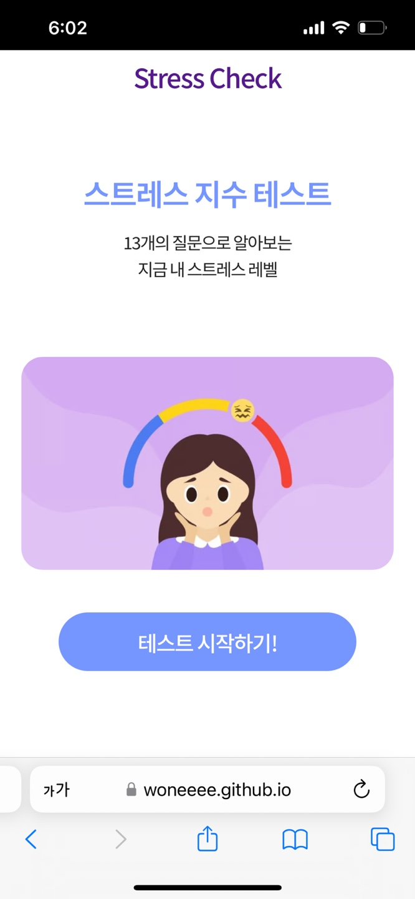
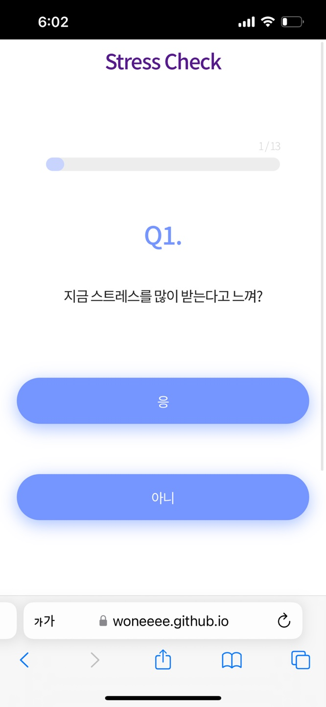
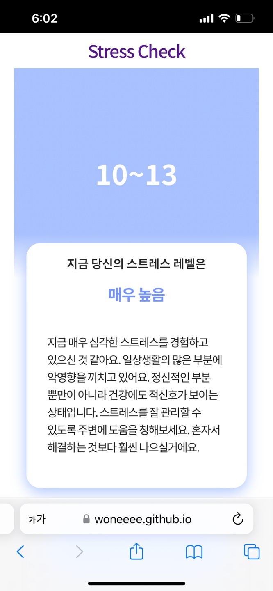

# StressCheck | Checking Stress Level

## 목적성

- 저는 최근 취업을 준비하면서 감정적으로 많은 힘듦을 겪었는데 저 뿐만 아니라 많은 현대인들이 각자만의 스트레스 속에서 살아가고 있을 것이라 생각하였습니다. 그리하여 현대인의 고질병인 ‘스트레스에 대한 레벨' 을 파악하여 그에 맞는 조치를 취할 수 있도록 돕고싶어 ‘스트레스 지수 테스트’ 웹앱을 개발하기로 하였습니다.

- 따라서 이 앱은 15가지 질문을 통하여 본인의 스트레스 지수를 파악할 수 있도록 제작하였습니다.

## Stack

  
   

- React
- HTML / CSS
- JS
- Node.js
- Git / GitHub

## 개발기간 및 계획표

| 제목 | 내용                                     |
| ---- | ---------------------------------------- |
| 9/22 | 기능 및 디자인 기획 / 데이터 수집        |
| 9/23 | 질문, 답변, 결과 데이터 정리 구성        |
| 9/24 | router설정 / 전체페이지 및 컴포넌트 구성 |
| 9/25 | Home - 시작버튼 구성                     |
| 9/26 | QnA - 질문, 답변 데이터 구성             |
| 9/27 | Result - 결과 페이지 구성                |
| 9/28 | 404페이지 구성, 수정 및 점검             |
| 9/29 | 코드정리, 유지보수 및 배포               |

## 프로젝트소개 및 URL

- GitHub URL - https://github.com/Woneeee/StressCheck
- Project URL - https://woneeee.github.io/StressCheck/

- 모바일 이미지

    
    
    

## 프로젝트를 하며 느낀점

### 프로젝트 진행 중 겪은 어려움

1. 여태까지는 api 를 사용하여 데이터를 받아오서 프로젝트를 진행했지만, 이번 사이드 프로젝트에서는 데이터를 직접 작성하여 알고리즘을 만들고자 했습니다. 따라서, 질문데이터와 질문의 답변에 대한 결과데이터를 만들어보았습니다. 그러나, 데이터를 만드는중에 어떤 형식을 사용해야 데이터를 불러오기에 편리할지 많은 고민을 했습니다.

2. 또한 응, 아니 각각 답변에 대한 스코어가 질문데이터에 저장이 되어있어 답변을 선택할때마다 스코어가 배열에 차례로 저장되게 만들고 그것을 결과페이지로 넘기고자 했습니다. 그러나, 어떻게 그 스코어를 저장을 시킬지 그리고 그것을 결과페이지로 넘길 수 있을지에 대한 방법을 생각하는데 많은 시간을 소요했습니다.

3. 마지막으로 결과 페이지로 받아온 스코어 값을 합산하고자 하였고, 그 합산한 값을 바탕으로 결과를 도출해 내고싶었는데 배열에 들어있는 스코어 값들을 모두 더하여 하나의 값으로 만드는 방법을 찾는데 어려움을 겪었습니다.

### 어려움을 해결한 방안

1. 질문데이터와 결과데이터를 어떻게 저장해야할지 고민하던중, qIndex 나 resultIndex를 만들어 useState를 사용해 초기값을 0 으로 해 둔 뒤, 답변을 클릭할때마다 숫자를 증가시켜 페이지가 넘어가는동시에 질문도 바뀌게 만들어야겠다고 생각했습니다. 따라서, 배열안에 질문과 답변에 대한 객체를 저장시키면 인덱스를 사용하여 데이터를 불러오기에 편하겠다고 생각했습니다.

2. 답변은 선택할때마다 그에 해당하는 스코어가 저장되게 하기위해 클릭이벤트에 함수를 선언하여 스코어값 인자를 넣었습니다. 그리고 미리만들어두었던 const [scores, setScores] = useState([]) 가 있었고 함수가 호출될때마다 setScores([...scores, score]) 로 scores 값을 갱신시켜줄 수 있었습니다. 그리고 useNavigate를 사용해 결과페이지로 이동시킬때 state를 사용하여 scores 데이터를 넘겨주었습니다.

3. 마지막으로 결과페이지에서 배열에 저장된 scores 점수를 합산하기 위해 reduce 함수를 새롭게 사용하게 되었고 콜백함수에 accumulator, currentValue 인자를 활용해 점수를 합산할 수 있었습니다.

## 프로젝트를 하면서 알게된 내용

- 먼저 'onClick' Event 실행할때

## 프로젝트 진행중 칭찬 및 반성

- 칭찬

- 반성

## 앞으로의 개발 방향
